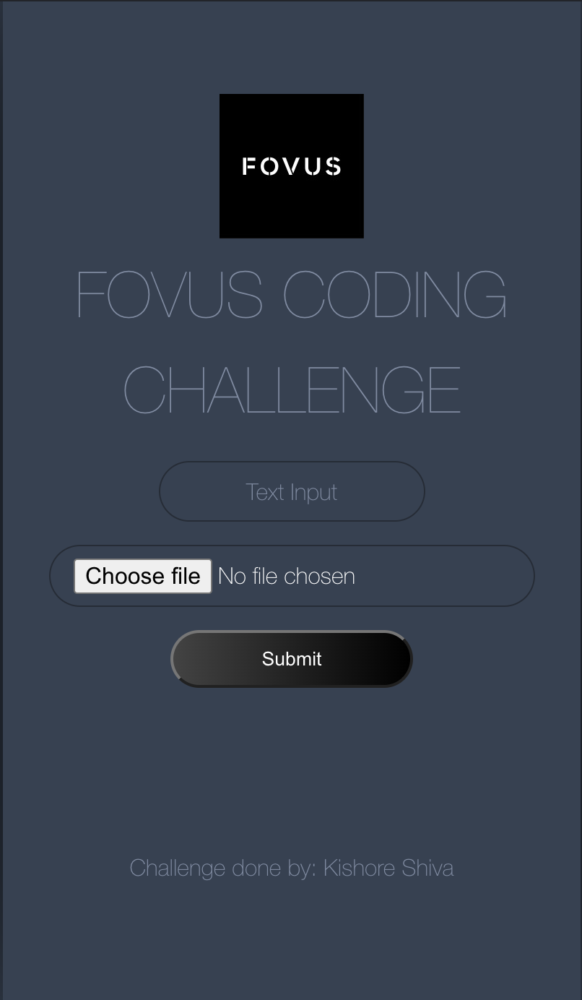

# Fovus Coding challenge: Welcome to the CDK TypeScript project

A Full Detailed Video explanation of the Output and Code: [https://youtu.be/TYQYyzUZYH8](https://youtu.be/TYQYyzUZYH8) **Only people with the Link can access this video.

## Before Starting the CDK: Firstly Make Sure that Your Front-End Application is working Fine
- Github URL of the frontend: [https://github.com/kishore-shiva/fovus-challenge-react-app.git](https://github.com/kishore-shiva/fovus-challenge-react-app.git)
  - Make Sure to Add your AWS Account credentials on your .env file for your project
- AWS-amplify Deployed URL of the front-end: [https://main.dvh6atqheb1qo.amplifyapp.com/](https://main.dvh6atqheb1qo.amplifyapp.com/)
    - 

## Getting Started with your CDK Project
- Clone this Repository onto your System
- Download NodeJS Latest Version, find at: [https://nodejs.org/en/download](https://nodejs.org/en/download)
- Please run the following commands to set up all the prerequisites for your project:
  - Install AWS CLI: [https://docs.aws.amazon.com/cli/latest/userguide/getting-started-install.html](https://docs.aws.amazon.com/cli/latest/userguide/getting-started-install.html)
  - Go to Your Project Directory and Execute the commands:
    - `npm i -g aws-cdk typescript`  Install AWS-CDK typescript development libraries
        - Check your CDK installation by running: `cdk version`
        - Check your Typescript installation by running: `tsv -v`
    - `npm install`  Install the required libraries for this CDK project
    - `aws configure` Execute and copy paste down your AWS User Credentials
    - `npm run build` Compiles all your Typescript files into Javascript for CDK deployment
    - `cdk bootstrap` Boostraps all your deployable components - Ready to get deployed
    - `cdk deploy` Deploys all the AWS resources mentioned in your CDK Stack and your Lambda Function in /lamda/* directory
    - Note: Before running all, please make sure you add the following Permissions/Policies to your AWS Users and Roles
    - On your AWS User, please add the policies using your AWS IAM console:
        - `Administrator Access`
        - `Administrator Access Amplify`
        - `AmazonAPIGatewayInvokeFullAccess`
        - `AmazonAPIGatewayPushToCloudWatchLogs`
        - `AmazonSSMFullAccess`
        - `AmazonSSMManagedEC2InstanceDefaultPolicy`
        - `AmazonSSMManagedInstanceCore`
        - Custom Policy:
            - ```{ "Version": "2012-10-17", "Statement": [ { "Effect": "Allow", "Action": [ "ec2:DescribeInstances", "ec2:DescribeInstanceStatus", "ec2:DescribeTags" ], "Resource": "*" }, { "Effect": "Allow", "Action": [ "ec2:StartInstances", "ec2:StopInstances", "ec2:RebootInstances" ], "Resource": "arn:aws:ec2:<Your-AWS-Region>:<AWS Account Number>:instance/<Your EC2 Instance ID>" } ] }```
    - On your AWS EC2 and Lambda Role, please add the following policies using your IAM console:
        - `AdministratorAccess`
        - `AmazonVPCCrossAccountNetworkInterfaceOperations`
        - `AmazonVPCFullAccess`
        - `AWSLambdaBasicExecutionRole`
        - Custom Policy:
            - ```{ "Version": "2012-10-17", "Statement": [ { "Effect": "Allow", "Action": [ "ec2:DescribeInstances", "ec2:DescribeInstanceStatus", "ec2:DescribeTags" ], "Resource": "*" }, { "Effect": "Allow", "Action": [ "ec2:StartInstances", "ec2:StopInstances", "ec2:RebootInstances" ], "Resource": "arn:aws:ec2:<Your-AWS-Region>:<AWS Account Number>:instance/<Your EC2 Instance ID>" } ] }```
        - Custom Inline Policy:
            ```{"Version": "2012-10-17","Statement": [{ "Action": ["ec2:AuthorizeSecurityGroupIngress","ec2:AuthorizeSecurityGroupEgress","ec2:RevokeSecurityGroupIngress","ec2:RevokeSecurityGroupEgress"],"Resource": ["arn:aws:ec2:<Your AWS Region>:<AWS Account Number>:security-group/<AWS Role's Security Group Number (starts with sg-*)>"], "Effect": "Allow" } ] }```
    -  If You Encounter Any Issues while deploying or Running your Project, please refer this docs for some common solutions where I got stuck there too while development: [https://docs.google.com/document/d/14HbCa-JzTi-U4M7NxN4L5dYyTxcXCFDlit7dkNuZpJM/edit?usp=sharing](https://docs.google.com/document/d/14HbCa-JzTi-U4M7NxN4L5dYyTxcXCFDlit7dkNuZpJM/edit?usp=sharing)
    - Please feel free to contact me in case your have any questions regarding this project, email me at: [ksaravanan@hawk.iit.edu](mailto:ksaravanan@hawk.iit.edu)

## Some other Useful commands

* `npm run build`   compile typescript to js
* `npm run watch`   watch for changes and compile
* `npm run test`    perform the jest unit tests
* `npx cdk deploy`  deploy this stack to your default AWS account/region
* `npx cdk diff`    compare deployed stack with current state
* `npx cdk synth`   emits the synthesized CloudFormation template
